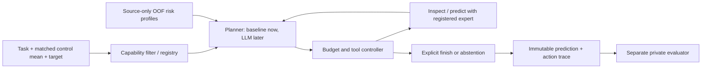

# Task- and background-conditioned model selection

This is the first executable architecture for the project's new direction:
select a complete perturbation predictor for a query, inspect permitted evidence,
execute tools within a declared budget and explicitly finish with one prediction.
The legacy `vcell.agent` tunes training hyperparameters; it is a different task.

**Current scope: architecture and inference validation.** No live LLM provider,
new source-OOF refit matrix, 72-cell policy benchmark or HT29 confirmation is
launched here. Deterministic policies are labelled baselines throughout outputs.
The synthetic demonstration is not a biological performance result.



## Components and information boundaries

| Component | Implementation | Responsibility |
|---|---|---|
| Query contract | `model_agent/contracts.py` | Human CRISPRi mean delta; fixed gene order and normalized control mean. Unknown query fields are rejected. |
| Expert registry | `model_agent/experts.py` | Checkpoint, transforms, panel, supported tasks, fit provenance and declared cost. Model names alone are insufficient. |
| Expert adapters | `model_agent/experts.py` | Reload actual P4 Ridge/factor weights; cross-context fit-only same-target reference. No prepared response matrix is loaded at inference. |
| Capability profiles | `model_agent/evidence.py` | Evaluate supplied source-OOF expert bundles and fit log-MSE Ridge estimators. No outer score import. |
| Planner interface | `planner.decide(observation) -> Action` | Choose `inspect`, `predict`, `finish` or `abstain`. A future LLM implements this same interface. |
| Controller | `model_agent/runtime.py` | Validate every action, charge tools, cache predictions, persist decisions and recover pending execution. |
| Evaluator | `model_agent/runtime.py` | Read private development truth only after decisions are sealed. Posthoc oracle is analysis-only. |

Planner observations contain task metadata, supported candidates, estimated risks,
declared costs, inspected feature summaries and prediction summaries. They contain
no expression matrices, private responses, filesystem paths or held-out errors.
Model disagreement is reported as a diagnostic; it never directly proves quality.

The capability filter currently checks species, intervention, normalization,
ordered gene panel, available target annotation and usable reference donors.
An unseen fit target is supported by a P4 head only if its frozen relation table
already contains that target. This does not provide universal zero-shot gene
annotation, arbitrary species, stimulus transfer or single-cell distributions.

Use the prepared dataset's **full background identifier**, e.g. `A549_IFNG`, and
explicit stimulus. Names are metadata, not evidence that two studies/conditions
are biologically equivalent. Case variants cannot bypass OOF background exclusion;
study/batch hierarchy and stable target aliases must be frozen when producing
the real next-round folds. The current framework does not infer these identities.

## Run the offline architecture check on AutoDL

```bash
cd /root/autodl-tmp/virtual_cell
bash scripts/run_model_agent_autodl.sh demo \
  --output /root/autodl-tmp/vcell-work/runs/model_agent_arch_01
```

No new dependency, model download, API key or GPU training is required. The demo
builds two **synthetic linear experts**, fits profiles from separate synthetic
source contexts and executes four baselines through the same tool controller:

- `fixed`: best fixed expert according to source OOF average MSE.
- `rule`: cheapest supported expert; this is a minimal rule comparator.
- `risk`: one expert selected by estimated source-only risk.
- `workflow`: fixed tool workflow that executes up to two affordable experts and
  finishes according to estimated risk. It is not an adaptive LLM agent.

```bash
bash scripts/run_model_agent_autodl.sh demo \
  --output /root/autodl-tmp/vcell-work/runs/model_agent_arch_01 --resume
```

Inspect `stage.json`, each policy's `result.json` and `trace.json`, and return
`model_agent_review_light.tar.gz`. The small package excludes control/response
arrays, private score tables and model weights. `synthetic=true`,
`llm_called=false` and `formal_agent_experiment=false` distinguish this from a
scientific experiment. The evaluator does not change a selected prediction.

## Register real completed P4 experts

For example, export matched seed17/context workers after P4 completes:

```bash
.venv/bin/python scripts/model_agent.py export-p4 \
  --worker /root/autodl-tmp/vcell-work/runs/round15_p4_02/models/context_reference_seed17 \
  --output /root/autodl-tmp/vcell-work/agent_pool/p4_reference_01
.venv/bin/python scripts/model_agent.py export-p4 \
  --worker /root/autodl-tmp/vcell-work/runs/round15_p4_02/models/context_expanded_seed17 \
  --output /root/autodl-tmp/vcell-work/agent_pool/p4_expanded_01
.venv/bin/python scripts/model_agent.py combine \
  --registries /root/autodl-tmp/vcell-work/agent_pool/p4_reference_01/registry.json \
               /root/autodl-tmp/vcell-work/agent_pool/p4_expanded_01/registry.json \
  --output /root/autodl-tmp/vcell-work/agent_pool/p4_registry_01.json
```

Each exported pool contains Ridge, rank16, rank32 and a fit-only reference tool.
References use same-target donors from different fit contexts; absent references
make that tool ineligible. Model checkpoints, encoder normalization, feature
transforms and response bases are copied into checksummed deployment bundles.
Fit/calibration context and row membership remain in provenance. Historical
`per_target.csv`/outer scores are **not** used as capability profiles.

P4 `expanded` retains P4's equal-context training allocation. It is **not** a new
fixed-source-ratio recipe. Native State/scGPT/etc. pipelines are not registered
as standalone predictors unless their complete prediction adapters are added.
The adapter currently runs on CPU for reproducible inference checks; GPU cost
profiling and batch execution are next-stage work.

Export a control-only query without decoding the prepared `delta` member:

If P4 harmonized target aliases, use `config.data_dir` from the worker's
`manifest.json` (the harmonized dataset) instead of the raw adapter path below.
Query targets must match the exported frozen annotation vocabulary.

```bash
.venv/bin/python scripts/model_agent.py query \
  --data /root/autodl-tmp/vcell-work/prepared/round15_mixscale_ifng_04/prepared \
  --row-id ACTUAL_ROW_ID --output /root/autodl-tmp/vcell-work/agent_query_01.json
.venv/bin/python scripts/model_agent.py inspect \
  --registry /root/autodl-tmp/vcell-work/agent_pool/p4_registry_01.json \
  --query /root/autodl-tmp/vcell-work/agent_query_01.json
.venv/bin/python scripts/model_agent.py run \
  --registry /root/autodl-tmp/vcell-work/agent_pool/p4_registry_01.json \
  --query /root/autodl-tmp/vcell-work/agent_query_01.json \
  --policy rule --budget-units 2 \
  --output /root/autodl-tmp/vcell-work/runs/agent_prediction_01
```

This checks deployment, not unseen-background accuracy. Outputs identify whether
they use synthetic artifacts. The run's result still declares architecture scope.

## Source-OOF profiles are a prerequisite, not fabricated from old scores

`fit-profiles --spec FILE --output DIRECTORY` consumes an explicit specification:

```json
{
  "source_contexts": ["K562_IFNG", "BXPC3_IFNG", "HAP1_IFNG"],
  "excluded_contexts": ["A549_IFNG"],
  "episodes": [
    {"fold_id": "held_BXPC3", "bundle": "oof_bundle", "query": "query.json", "truth": "private_truth.npz"}
  ]
}
```

This abbreviated example is not runnable evidence: supply all experts on the
same queries from at least two independently held source backgrounds per expert.
Query exports preserve `source_partition` and the prepared-data fingerprint.
Profile fitting requires `source_partition=train`; old validation and unlabelled
deployment queries cannot become OOF evidence merely by changing a context list.
Each private truth file has only `genes`, `delta`, and `query_fingerprint`.
The query background must be absent from **both fit and calibration**, and the
outer background must be absent from every supplied expert's fit/calibration.
Panels, input fingerprints and expert recipes must match across OOF records.
Repeated optimizer seeds are not independent biological units. With this
single-predictor profile interface, fit a separate profile per seed and retain
the same query IDs. Across-seed aggregation belongs in the final report, not in
additional rows presented as independent source observations.

Features are calculated from allowed inputs: distance to fit-control statistics,
STRING coverage, cross-context reference count, fit-target availability and
fit-background availability. Features do not include the current true response.
Risks are log-MSE Ridge predictions, not calibrated confidence intervals. New
experts without matched OOF records have unknown risk and are not automatically
promoted by a model description.

Checks validate supplied lineage and disjointness; they do not independently
reproduce training. **A dedicated nested source-OOF refit runner is still needed.**
Current expanded P4 experts were fitted on the IFNG development contexts, so
they cannot provide OOF performance claims for those same contexts.

## Cost, recovery and LLM integration

Costs are declared **tool units** for architecture checks, not dollars, GPU
seconds or a hard wall-clock deadline. CPU latency is recorded separately.
Unmeasured exported P4 costs are labelled `unmeasured`; the synthetic demo uses
`synthetic`. Failed prediction attempts consume their declared charge. Cache hits
do not consume a new tool charge. Step limits prevent indefinite tool loops.

Pending actions are persisted before execution. `--resume` requires unchanged
queries, registry/bundles, profiles, planner identity, budgets and architecture
code. It replays a pending action without asking the planner for another decision.
An interrupted uncached tool can repeat physical computation; logical tool units
do not establish exactly-once physical work or API billing.

Inject a future planner with `execute(..., planner=..., planner_identity="VERSION")`.
Its `decide(observation)` returns a typed `Action` or the corresponding exact
dictionary. It cannot add tools, alter costs, finish with an unexecuted model,
request private labels or bypass capability checks. It receives a detached
observation copy. Provider integration will add structured-output parsing,
token/latency accounting, provider model/version provenance and mocked-provider
tests before any real API call. No provider/API is contacted in this version.

## Next formal experiment

1. Freeze the four IFNG development outer contexts, canonical target identities,
   expert recipes, source allocation, unit/replicate hierarchy and three seeds.
   Keep HT29/Jurkat closed; queries to them are rejected here.
2. Refit matched experts with each outer context excluded. Generate nested inner
   source-context OOF predictions for profiles, including the separately fixed
   source-ratio expanded recipe. Inspect complementarity using a private oracle.
3. Measure warm/cold inference, batching, memory, inspections and LLM planning
   cost. Freeze costs and budgets; align information access across policies.
4. Compare fixed, condition rule, learned static router, one-shot LLM, fixed
   workflow and adaptive LLM agent: 4 backgrounds × 3 seeds × 6 strategies = 72
   evaluation cells, with expert fitting and risk-profile fitting counted separately.
5. Seal decisions before private evaluation. Report macro MSE, target specificity,
   amplitude, zero/reference baselines, oracle gap and accuracy/cost curves.
   Predeclare ties and stopping; adding more experts is not itself an improvement.

Formal novelty or effectiveness is not established by implementing this loop.
This stage establishes auditable interfaces needed to test those claims.

## Glossary

- **Expert:** a complete executable predictor, including preprocessing and weights.
- **Registry:** the list of experts, their capabilities, provenance and costs.
- **OOF (out of fold):** prediction on a source background excluded from model fitting and calibration.
- **Risk profile:** an estimate of expected error based on allowed features and source OOF evidence.
- **Static router:** chooses a model once; it does not react to subsequent tool results.
- **Planner/controller:** the planner proposes actions; the controller validates and executes them.
- **Oracle:** a truth-aware best choice used only to measure potential improvement after prediction.
- **Abstention:** an explicit refusal to predict when no valid or affordable expert can be selected.
